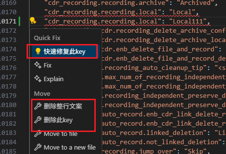
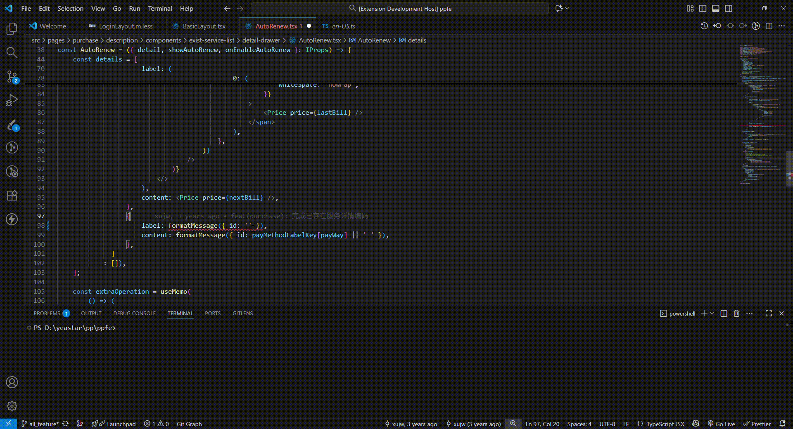

# locale-detector

* 实现校验输入的文案是否存在相同内容的文案

* 默认检测英文
* 鼠标切换行，对当前行的文案校验是否存在相同内容的文案
* 重复key可快捷操作key：删除、快速修复


* 支持快捷键ctrl+alt+s 搜索文案，并选择快速插入文案


# 拓展配置

* 在.vscode/settings.json中增加配置，更改支持检测的语言文件及是否跨文件检测
```json
{
  "local-detector.crossFile": false,
  "local-detector.languages": ["en-US", "zh-CN"]
}
```


## 快捷键

| 快捷键 | 功能 | 说明 |
|--------|------|------|
| `Ctrl+Alt+S` | 查询并插入文案 | 搜索项目中的文案内容，选择后插入对应的 key（目前仅支持搜索英文文件） |
> **注意**: 在 macOS 系统中，请使用 `Cmd` 键替代 `Ctrl` 键
