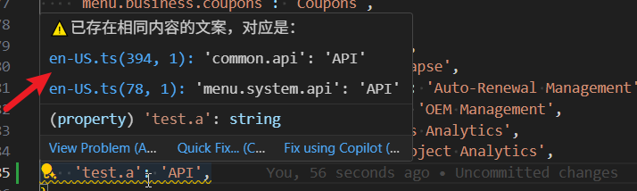

# locale-detector

* 实现校验输入的文案是否存在相同内容的文案
* 默认检测英文
* 鼠标切换行，对当前行的文案校验是否存在相同内容的文案

# 拓展配置

* 在.vscode/settings.json中增加配置，更改支持检测的语言文件及是否跨文件检测
* {
*   "local-detector.crossFile":false,
*    "local-detector.languages":["en-US","zh-CN"]
* }